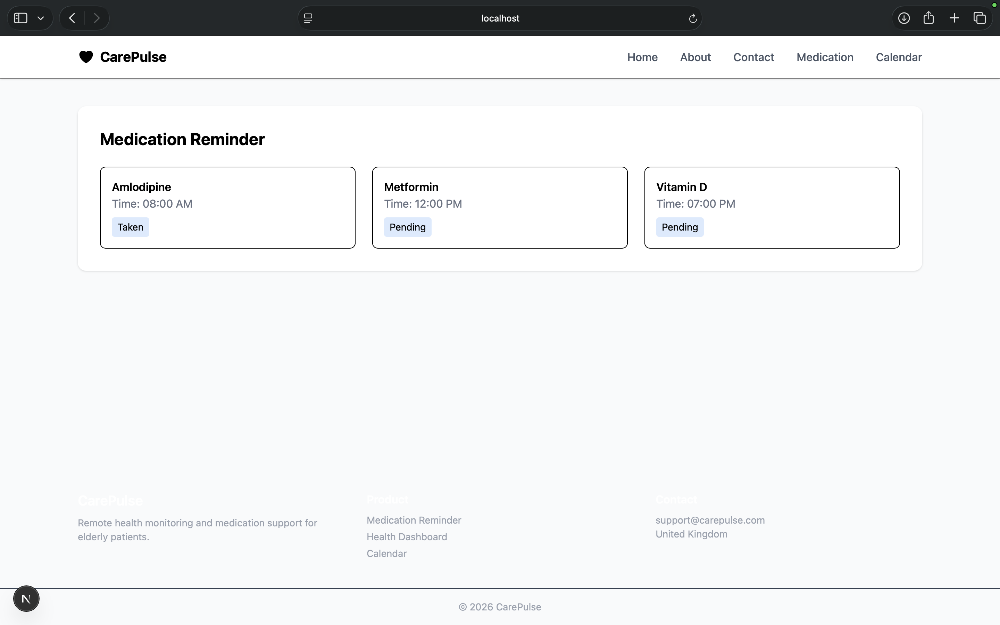
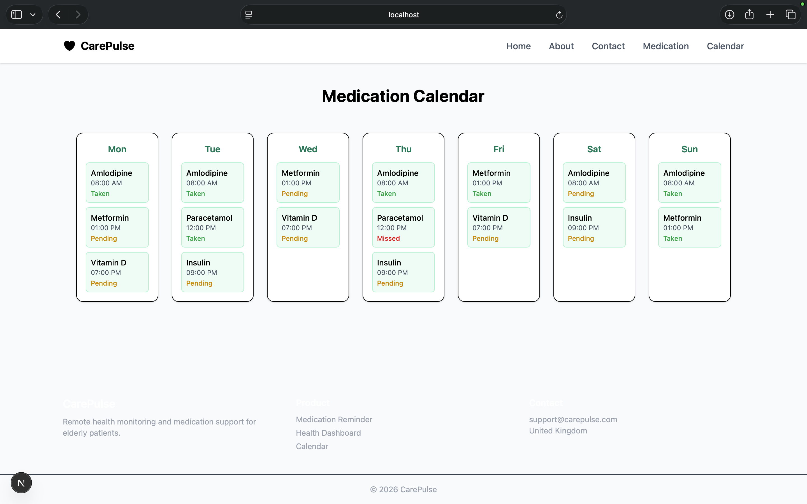

# CarePulse – Remote Health Monitoring Platform

CarePulse is a healthcare web application designed to support **older adults living independently** by helping them manage medication schedules and monitor daily wellbeing. The platform allows carers and healthcare workers to stay informed through reminders, alerts, and simple health tracking tools.

This project was developed as part of an **Agile Product Portfolio**, focusing on user-centred design and digital health support systems.

---

# Key Features

## Medication Reminder
Helps users remember to take medications at the correct time and track adherence.

## Medication Calendar
Displays a weekly calendar view showing scheduled medications and their status.

## Daily Wellbeing Monitoring
Allows users to perform quick wellbeing check-ins to monitor their health status.

## Support Level Alerts
Patient wellbeing is categorized into **Green, Amber, or Red** levels to identify when additional support is required.

## Carer Notifications
Alerts carers if medications are missed or if wellbeing status changes.

---

# Pages Implemented

The application includes the following pages:

- Home Page
- About Page
- Contact Page
- Medication Reminder Page
- Medication Calendar Page

---

# Screenshots

## Home Page


---

## About Page


---

## Contact Page


---

## Medication Reminder


---

## Medication Calendar


---

# Tech Stack

- **Next.js**
- **React**
- **Tailwind CSS**
- **JSON (dummy data)**

---

# Project Structure
```
care-pulse/
├── app/
│   ├── globals.css
│   ├── layout.tsx
│   ├── page.tsx
│   ├── about/
│   │   └── page.tsx
│   ├── components/
│   │   ├── Footer.tsx
│   │   └── Navbar.tsx
│   ├── contact/
│   │   └── page.tsx
│   ├── features/
│   │   ├── calendar/
│   │   │   └── page.tsx
│   │   └── medication-reminder/
│   │       └── page.tsx
├── data/
│   ├── calendar.json
│   └── medications.json
├── public/
│   ├── file.svg
│   ├── globe.svg
│   ├── next.svg
│   ├── vercel.svg
│   └── window.svg
├── screenshots/
│   ├── about_page.png
│   ├── calendar_page.png
│   ├── contact_page.png
│   ├── home_page.png
│   └── reminder_page.png
├── eslint.config.mjs
├── next-env.d.ts
├── next.config.ts
├── package.json
├── postcss.config.mjs
├── tailwind.config.js
├── tsconfig.json
└── README.md
```

# Getting Started

Follow these steps to run the project locally:

1. **Clone the repository:**
	```bash
	git clone https://github.com/shivamshashank/care-pulse
	cd care-pulse
	```
2. **Install dependencies:**
	```bash
	npm install
	```
3. **Run the development server:**
	```bash
	npm run dev
	```
4. Open [http://localhost:3000](http://localhost:3000) in your browser.

# License

This project is licensed under the MIT License.

