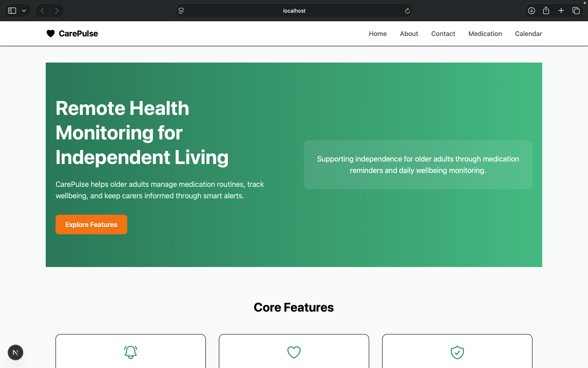
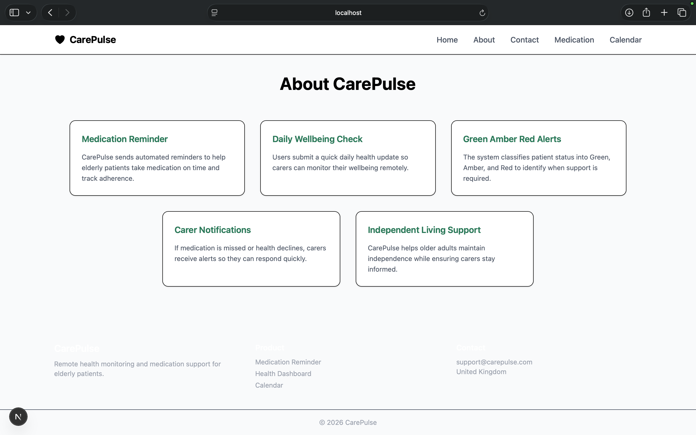
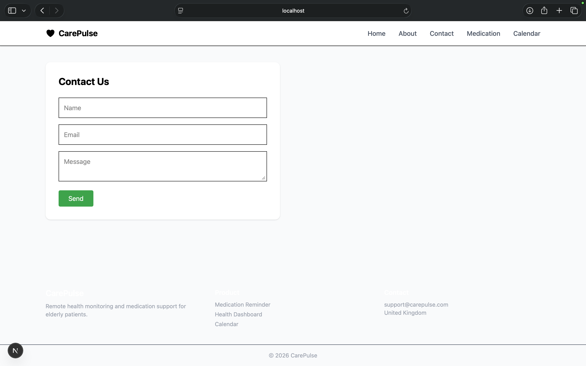
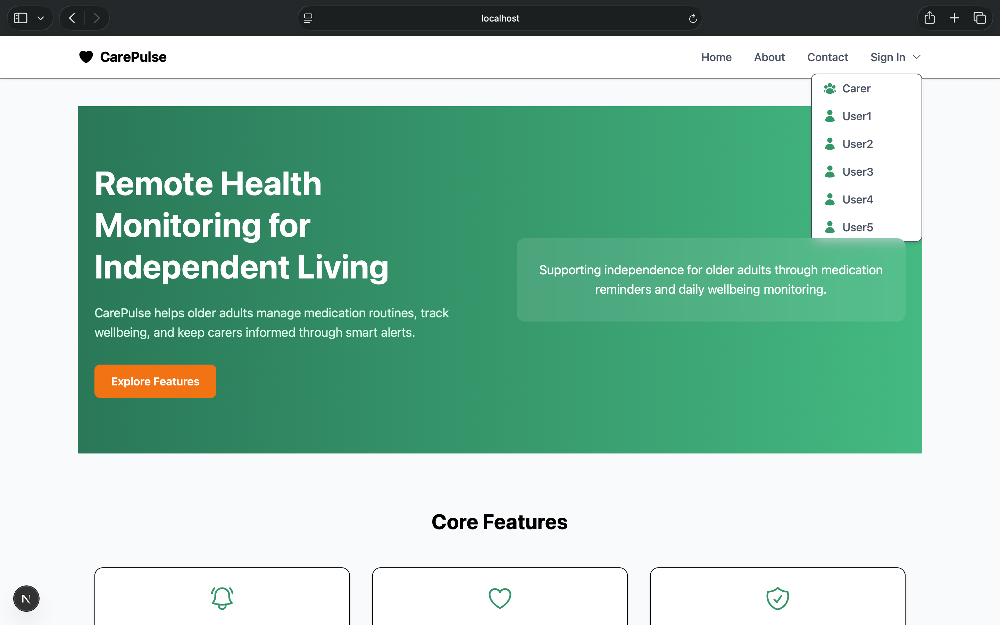
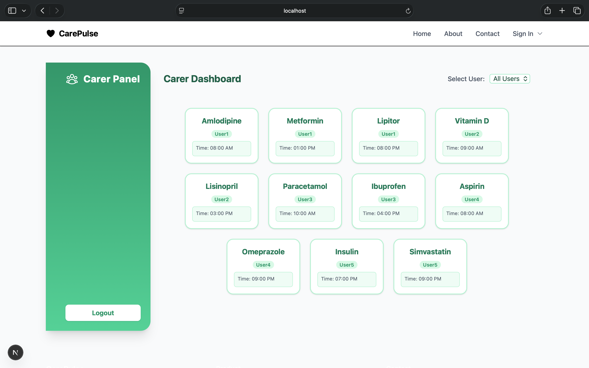
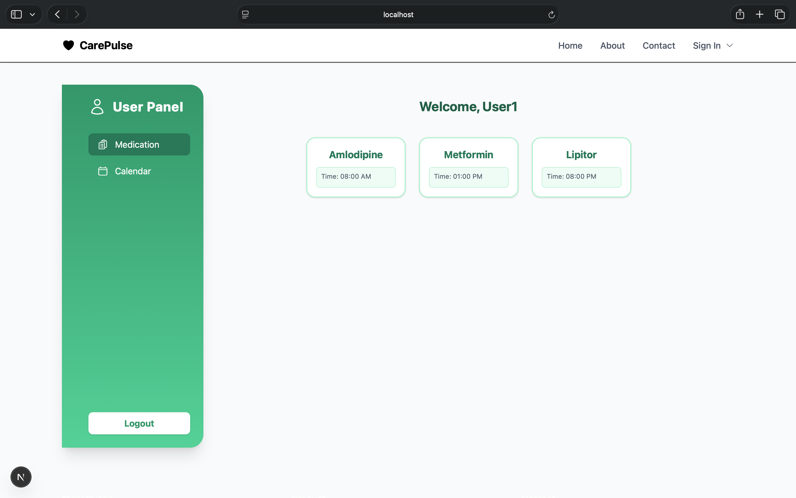
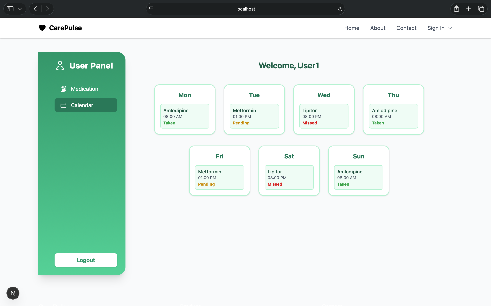

# CarePulse – Remote Health Monitoring Platform

CarePulse is a healthcare web application designed to support **older adults living independently** by helping them manage medication schedules and monitor daily wellbeing. The platform now supports multiple users and includes a dedicated **Carer Dashboard** for remote monitoring. Carers and healthcare workers can stay informed through reminders, alerts, and simple health tracking tools.

This project was developed as part of an **Agile Product Portfolio**, focusing on user-centred design and digital health support systems.

---

# Key Features

## Medication Reminder
Helps users remember to take medications at the correct time and track adherence.

## Medication Calendar
Displays a weekly calendar view showing scheduled medications and their status.

## Daily Wellbeing Monitoring
Allows users to perform quick wellbeing check-ins to monitor their health status.

## Carer Dashboard
A dedicated dashboard for carers to monitor the wellbeing and medication adherence of multiple users.

## Support Level Alerts
Patient wellbeing is categorized into **Green, Amber, or Red** levels to identify when additional support is required.

## Carer Notifications
Alerts carers if medications are missed or if wellbeing status changes.

---

# User Roles

The application supports two main user roles:

-   **User:** An individual managing their own medication and wellbeing. The app can support up to 5 users.
-   **Carer:** A person who monitors the users' activities and wellbeing through the Carer Dashboard.

---

# Pages Implemented

The application includes the following pages:

-   Home Page
-   About Page
-   Contact Page
-   Sign In Page
-   Medication Reminder Page
-   Medication Calendar Page
-   Carer Dashboard

---

# Screenshots

## Home Page


---

## About Page


---

## Contact Page


---

## Sign In Page
On the sign-in page, you can choose from `user1` to `user5` and `carer`.


---

## Carer Dashboard
The carer dashboard provides an overview of all users' medication and wellbeing status.


---

## Medication


---

## Calendar


---

# Tech Stack

-   **Next.js**
-   **React**
-   **Tailwind CSS**
-   **JSON (dummy data)** for multiple users and carer.

---

# Project Structure
```
care-pulse/
├── app/
│   ├── globals.css
│   ├── layout.tsx
│   ├── page.tsx
│   ├── about/
│   │   └── page.tsx
│   ├── carer/
│   │   └── page.tsx
│   ├── components/
│   │   ├── Footer.tsx
│   │   ├── Navbar.tsx
│   │   └── Sidebar.tsx
│   ├── contact/
│   │   └── page.tsx
│   ├── features/
│   │   ├── calendar/
│   │   │   └── page.tsx
│   │   └── medication-reminder/
│   │       └── page.tsx
│   └── user/
│       ├── calendar.tsx
│       ├── medication.tsx
│       └── page.tsx
├── data/
│   ├── calendar.json
│   ├── medications.json
│   └── users.json
├── public/
│   ├── file.svg
│   ├── globe.svg
│   ├── next.svg
│   ├── vercel.svg
│   └── window.svg
├── screenshots/
│   ├── about_page.png
│   ├── calendar.png
│   ├── carer_dashboard.png
│   ├── contact_page.png
│   ├── home_page.png
│   ├── medication.png
│   └── sign_in_page.png
├── eslint.config.mjs
├── next.config.ts
├── package.json
├── postcss.config.mjs
├── tailwind.config.js
├── tsconfig.json
└── README.md
```

# Getting Started

Follow these steps to run the project locally:

1.  **Clone the repository:**
    ```bash
    git clone https://github.com/shivamshashank/care-pulse
    cd care-pulse
    ```
2.  **Install dependencies:**
    ```bash
    npm install
    ```
3.  **Run the development server:**
    ```bash
    npm run dev
    ```
4.  Open [http://localhost:3000](http://localhost:3000) in your browser.

# License

This project is licensed under the MIT License.
